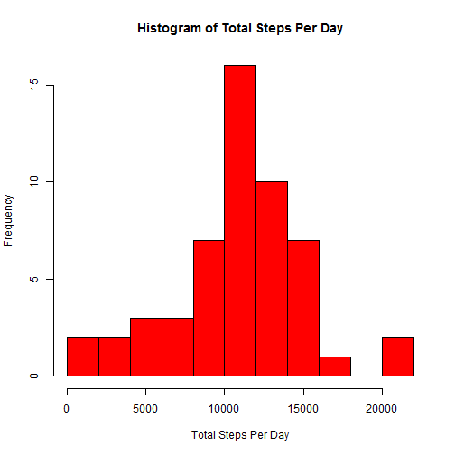
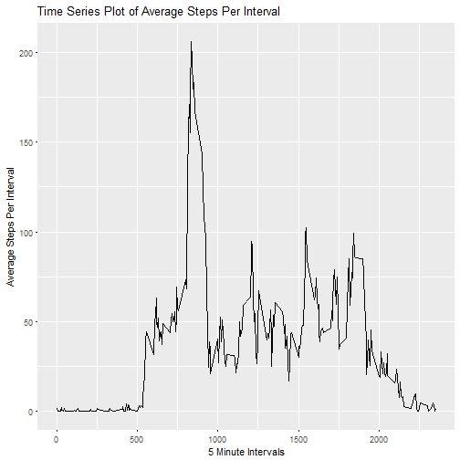
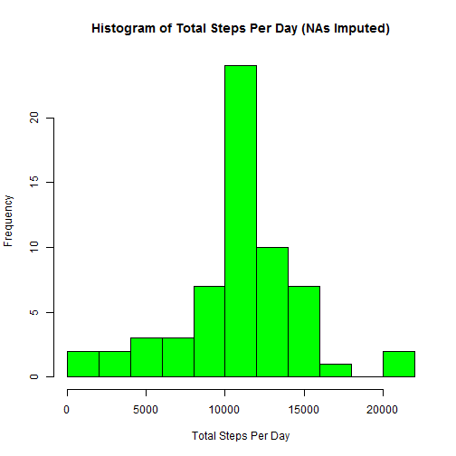
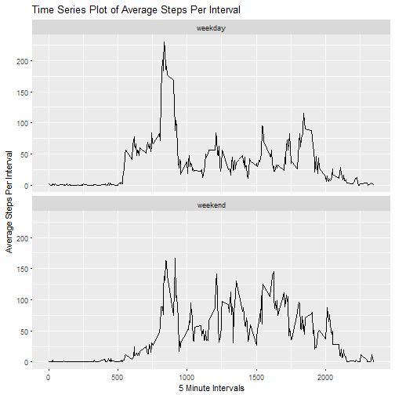

### Overview
This document shows simple analyses of an [activity monitoring data set](http://bit.ly/2kX7hjw).

The data contains details of personal movement collected using activity monitoring device(s). The device collected data at 5 minute intervals through out the day. The data consists of two months of data from an anonymous individual collected during the months of October and November, 2012 and include the number of steps taken in 5 minute intervals each day.

This document will show simple exploratory data analysis of the said data set.

### Loading and preprocessing the data

Before exploring the data, some setup must be performed.


This is to load the dataset into the R variable 'ad':


```r
   temp <- tempfile()
  download.file("https://d396qusza40orc.cloudfront.net/repdata%2Fdata%2Factivity.zip", 
                temp)
  ad <- read.csv(unz(temp, "activity.csv"), header = TRUE)
  unlink(temp)
```

### Mean Total Number of Steps Taken Per Day

To get a better grasp of the data, the steps below are performed. The succeeding steps are done ignoring the missing values or NAs.

1. Calculate the total number of steps taken per day  

```r
  library(datasets)
  library(xtable)
  library(plyr)
  
  ## Get the daily sum of steps
  sumdat <- aggregate(ad$steps, by=list(ad$date), FUN=sum)
  sumdat <- rename( sumdat, c("Group.1" ="Date", "x"="SummedSteps"))
  
  ## Doing things the hard way for the sake of more compact tables *_*
  temptab1 <- sumdat[sumdat$Date %in% unique(ad$date)[1:16], 1:2]
  temptab2 <- sumdat[sumdat$Date %in% unique(ad$date)[17:31], 1:2]
  temptab3 <- sumdat[sumdat$Date %in% unique(ad$date)[32:46], 1:2]
  temptab4 <- sumdat[sumdat$Date %in% unique(ad$date)[47:61], 1:2]
  temptab2 <- rbind(temptab2, NA)
  temptab3 <- rbind(temptab3, NA)
  temptab4 <- rbind(temptab4, NA)
  

  xt <- xtable(cbind(temptab1, " ", temptab2, " ", temptab3, " ", temptab4))
  print(xt, type='html')
```

<!-- html table generated in R 3.3.2 by xtable 1.8-2 package -->
<!-- Sun Mar 05 20:10:56 2017 -->
<table border=1>
<tr> <th>  </th> <th> Date </th> <th> SummedSteps </th> <th> " " </th> <th> Date </th> <th> SummedSteps </th> <th> " " </th> <th> Date </th> <th> SummedSteps </th> <th> " " </th> <th> Date </th> <th> SummedSteps </th>  </tr>
  <tr> <td align="right"> 1 </td> <td> 2012-10-01 </td> <td align="right">  </td> <td>   </td> <td> 2012-10-17 </td> <td align="right"> 13452 </td> <td>   </td> <td> 2012-11-01 </td> <td align="right">  </td> <td>   </td> <td> 2012-11-16 </td> <td align="right"> 5441 </td> </tr>
  <tr> <td align="right"> 2 </td> <td> 2012-10-02 </td> <td align="right"> 126 </td> <td>   </td> <td> 2012-10-18 </td> <td align="right"> 10056 </td> <td>   </td> <td> 2012-11-02 </td> <td align="right"> 10600 </td> <td>   </td> <td> 2012-11-17 </td> <td align="right"> 14339 </td> </tr>
  <tr> <td align="right"> 3 </td> <td> 2012-10-03 </td> <td align="right"> 11352 </td> <td>   </td> <td> 2012-10-19 </td> <td align="right"> 11829 </td> <td>   </td> <td> 2012-11-03 </td> <td align="right"> 10571 </td> <td>   </td> <td> 2012-11-18 </td> <td align="right"> 15110 </td> </tr>
  <tr> <td align="right"> 4 </td> <td> 2012-10-04 </td> <td align="right"> 12116 </td> <td>   </td> <td> 2012-10-20 </td> <td align="right"> 10395 </td> <td>   </td> <td> 2012-11-04 </td> <td align="right">  </td> <td>   </td> <td> 2012-11-19 </td> <td align="right"> 8841 </td> </tr>
  <tr> <td align="right"> 5 </td> <td> 2012-10-05 </td> <td align="right"> 13294 </td> <td>   </td> <td> 2012-10-21 </td> <td align="right"> 8821 </td> <td>   </td> <td> 2012-11-05 </td> <td align="right"> 10439 </td> <td>   </td> <td> 2012-11-20 </td> <td align="right"> 4472 </td> </tr>
  <tr> <td align="right"> 6 </td> <td> 2012-10-06 </td> <td align="right"> 15420 </td> <td>   </td> <td> 2012-10-22 </td> <td align="right"> 13460 </td> <td>   </td> <td> 2012-11-06 </td> <td align="right"> 8334 </td> <td>   </td> <td> 2012-11-21 </td> <td align="right"> 12787 </td> </tr>
  <tr> <td align="right"> 7 </td> <td> 2012-10-07 </td> <td align="right"> 11015 </td> <td>   </td> <td> 2012-10-23 </td> <td align="right"> 8918 </td> <td>   </td> <td> 2012-11-07 </td> <td align="right"> 12883 </td> <td>   </td> <td> 2012-11-22 </td> <td align="right"> 20427 </td> </tr>
  <tr> <td align="right"> 8 </td> <td> 2012-10-08 </td> <td align="right">  </td> <td>   </td> <td> 2012-10-24 </td> <td align="right"> 8355 </td> <td>   </td> <td> 2012-11-08 </td> <td align="right"> 3219 </td> <td>   </td> <td> 2012-11-23 </td> <td align="right"> 21194 </td> </tr>
  <tr> <td align="right"> 9 </td> <td> 2012-10-09 </td> <td align="right"> 12811 </td> <td>   </td> <td> 2012-10-25 </td> <td align="right"> 2492 </td> <td>   </td> <td> 2012-11-09 </td> <td align="right">  </td> <td>   </td> <td> 2012-11-24 </td> <td align="right"> 14478 </td> </tr>
  <tr> <td align="right"> 10 </td> <td> 2012-10-10 </td> <td align="right"> 9900 </td> <td>   </td> <td> 2012-10-26 </td> <td align="right"> 6778 </td> <td>   </td> <td> 2012-11-10 </td> <td align="right">  </td> <td>   </td> <td> 2012-11-25 </td> <td align="right"> 11834 </td> </tr>
  <tr> <td align="right"> 11 </td> <td> 2012-10-11 </td> <td align="right"> 10304 </td> <td>   </td> <td> 2012-10-27 </td> <td align="right"> 10119 </td> <td>   </td> <td> 2012-11-11 </td> <td align="right"> 12608 </td> <td>   </td> <td> 2012-11-26 </td> <td align="right"> 11162 </td> </tr>
  <tr> <td align="right"> 12 </td> <td> 2012-10-12 </td> <td align="right"> 17382 </td> <td>   </td> <td> 2012-10-28 </td> <td align="right"> 11458 </td> <td>   </td> <td> 2012-11-12 </td> <td align="right"> 10765 </td> <td>   </td> <td> 2012-11-27 </td> <td align="right"> 13646 </td> </tr>
  <tr> <td align="right"> 13 </td> <td> 2012-10-13 </td> <td align="right"> 12426 </td> <td>   </td> <td> 2012-10-29 </td> <td align="right"> 5018 </td> <td>   </td> <td> 2012-11-13 </td> <td align="right"> 7336 </td> <td>   </td> <td> 2012-11-28 </td> <td align="right"> 10183 </td> </tr>
  <tr> <td align="right"> 14 </td> <td> 2012-10-14 </td> <td align="right"> 15098 </td> <td>   </td> <td> 2012-10-30 </td> <td align="right"> 9819 </td> <td>   </td> <td> 2012-11-14 </td> <td align="right">  </td> <td>   </td> <td> 2012-11-29 </td> <td align="right"> 7047 </td> </tr>
  <tr> <td align="right"> 15 </td> <td> 2012-10-15 </td> <td align="right"> 10139 </td> <td>   </td> <td> 2012-10-31 </td> <td align="right"> 15414 </td> <td>   </td> <td> 2012-11-15 </td> <td align="right">  41 </td> <td>   </td> <td> 2012-11-30 </td> <td align="right">  </td> </tr>
  <tr> <td align="right"> 16 </td> <td> 2012-10-16 </td> <td align="right"> 15084 </td> <td>   </td> <td>  </td> <td align="right">  </td> <td>   </td> <td>  </td> <td align="right">  </td> <td>   </td> <td>  </td> <td align="right">  </td> </tr>
   </table>

  
2. Make a histogram of the total number of steps taken each day.  


```r
   hist(sumdat$SummedSteps,
        main = "Histogram of Total Steps Per Day",
        xlab = "Total Steps Per Day",
        col="red",
        breaks = 10)
```


  
  
3. Calculate and report the mean and median of the total number of steps taken per day  


```r
  meandat <- aggregate(ad$steps, by=list(ad$date), FUN=mean)
  meandat <- rename( meandat, c("Group.1" ="Date", "x"="MeanSteps"))
  mediandat <- aggregate(ad$steps, by=list(ad$date), FUN=median, na.rm=TRUE)
  meanmed <- cbind(meandat, MedianSteps = mediandat$x )
  
  ## Doing things the hard way for the sake of more compact tables *_*
  temptab1 <- meanmed[meanmed$Date %in% unique(ad$date)[1:21], 1:3]
  temptab2 <- meanmed[meanmed$Date %in% unique(ad$date)[22:41], 1:3]
  temptab3 <- meanmed[meanmed$Date %in% unique(ad$date)[42:61], 1:3]
  temptab2 <- rbind(temptab2, NA)
  temptab3 <- rbind(temptab3, NA)
  

  xt <- xtable(cbind(temptab1, NA , temptab2, NA , temptab3))
  print(xt, type='html')
```

<!-- html table generated in R 3.3.2 by xtable 1.8-2 package -->
<!-- Sun Mar 05 20:10:56 2017 -->
<table border=1>
<tr> <th>  </th> <th> Date </th> <th> MeanSteps </th> <th> MedianSteps </th> <th> NA </th> <th> Date </th> <th> MeanSteps </th> <th> MedianSteps </th> <th> NA </th> <th> Date </th> <th> MeanSteps </th> <th> MedianSteps </th>  </tr>
  <tr> <td align="right"> 1 </td> <td> 2012-10-01 </td> <td align="right">  </td> <td align="right">  </td> <td>  </td> <td> 2012-10-22 </td> <td align="right"> 46.74 </td> <td align="right"> 0.00 </td> <td>  </td> <td> 2012-11-11 </td> <td align="right"> 43.78 </td> <td align="right"> 0.00 </td> </tr>
  <tr> <td align="right"> 2 </td> <td> 2012-10-02 </td> <td align="right"> 0.44 </td> <td align="right"> 0.00 </td> <td>  </td> <td> 2012-10-23 </td> <td align="right"> 30.97 </td> <td align="right"> 0.00 </td> <td>  </td> <td> 2012-11-12 </td> <td align="right"> 37.38 </td> <td align="right"> 0.00 </td> </tr>
  <tr> <td align="right"> 3 </td> <td> 2012-10-03 </td> <td align="right"> 39.42 </td> <td align="right"> 0.00 </td> <td>  </td> <td> 2012-10-24 </td> <td align="right"> 29.01 </td> <td align="right"> 0.00 </td> <td>  </td> <td> 2012-11-13 </td> <td align="right"> 25.47 </td> <td align="right"> 0.00 </td> </tr>
  <tr> <td align="right"> 4 </td> <td> 2012-10-04 </td> <td align="right"> 42.07 </td> <td align="right"> 0.00 </td> <td>  </td> <td> 2012-10-25 </td> <td align="right"> 8.65 </td> <td align="right"> 0.00 </td> <td>  </td> <td> 2012-11-14 </td> <td align="right">  </td> <td align="right">  </td> </tr>
  <tr> <td align="right"> 5 </td> <td> 2012-10-05 </td> <td align="right"> 46.16 </td> <td align="right"> 0.00 </td> <td>  </td> <td> 2012-10-26 </td> <td align="right"> 23.53 </td> <td align="right"> 0.00 </td> <td>  </td> <td> 2012-11-15 </td> <td align="right"> 0.14 </td> <td align="right"> 0.00 </td> </tr>
  <tr> <td align="right"> 6 </td> <td> 2012-10-06 </td> <td align="right"> 53.54 </td> <td align="right"> 0.00 </td> <td>  </td> <td> 2012-10-27 </td> <td align="right"> 35.14 </td> <td align="right"> 0.00 </td> <td>  </td> <td> 2012-11-16 </td> <td align="right"> 18.89 </td> <td align="right"> 0.00 </td> </tr>
  <tr> <td align="right"> 7 </td> <td> 2012-10-07 </td> <td align="right"> 38.25 </td> <td align="right"> 0.00 </td> <td>  </td> <td> 2012-10-28 </td> <td align="right"> 39.78 </td> <td align="right"> 0.00 </td> <td>  </td> <td> 2012-11-17 </td> <td align="right"> 49.79 </td> <td align="right"> 0.00 </td> </tr>
  <tr> <td align="right"> 8 </td> <td> 2012-10-08 </td> <td align="right">  </td> <td align="right">  </td> <td>  </td> <td> 2012-10-29 </td> <td align="right"> 17.42 </td> <td align="right"> 0.00 </td> <td>  </td> <td> 2012-11-18 </td> <td align="right"> 52.47 </td> <td align="right"> 0.00 </td> </tr>
  <tr> <td align="right"> 9 </td> <td> 2012-10-09 </td> <td align="right"> 44.48 </td> <td align="right"> 0.00 </td> <td>  </td> <td> 2012-10-30 </td> <td align="right"> 34.09 </td> <td align="right"> 0.00 </td> <td>  </td> <td> 2012-11-19 </td> <td align="right"> 30.70 </td> <td align="right"> 0.00 </td> </tr>
  <tr> <td align="right"> 10 </td> <td> 2012-10-10 </td> <td align="right"> 34.38 </td> <td align="right"> 0.00 </td> <td>  </td> <td> 2012-10-31 </td> <td align="right"> 53.52 </td> <td align="right"> 0.00 </td> <td>  </td> <td> 2012-11-20 </td> <td align="right"> 15.53 </td> <td align="right"> 0.00 </td> </tr>
  <tr> <td align="right"> 11 </td> <td> 2012-10-11 </td> <td align="right"> 35.78 </td> <td align="right"> 0.00 </td> <td>  </td> <td> 2012-11-01 </td> <td align="right">  </td> <td align="right">  </td> <td>  </td> <td> 2012-11-21 </td> <td align="right"> 44.40 </td> <td align="right"> 0.00 </td> </tr>
  <tr> <td align="right"> 12 </td> <td> 2012-10-12 </td> <td align="right"> 60.35 </td> <td align="right"> 0.00 </td> <td>  </td> <td> 2012-11-02 </td> <td align="right"> 36.81 </td> <td align="right"> 0.00 </td> <td>  </td> <td> 2012-11-22 </td> <td align="right"> 70.93 </td> <td align="right"> 0.00 </td> </tr>
  <tr> <td align="right"> 13 </td> <td> 2012-10-13 </td> <td align="right"> 43.15 </td> <td align="right"> 0.00 </td> <td>  </td> <td> 2012-11-03 </td> <td align="right"> 36.70 </td> <td align="right"> 0.00 </td> <td>  </td> <td> 2012-11-23 </td> <td align="right"> 73.59 </td> <td align="right"> 0.00 </td> </tr>
  <tr> <td align="right"> 14 </td> <td> 2012-10-14 </td> <td align="right"> 52.42 </td> <td align="right"> 0.00 </td> <td>  </td> <td> 2012-11-04 </td> <td align="right">  </td> <td align="right">  </td> <td>  </td> <td> 2012-11-24 </td> <td align="right"> 50.27 </td> <td align="right"> 0.00 </td> </tr>
  <tr> <td align="right"> 15 </td> <td> 2012-10-15 </td> <td align="right"> 35.20 </td> <td align="right"> 0.00 </td> <td>  </td> <td> 2012-11-05 </td> <td align="right"> 36.25 </td> <td align="right"> 0.00 </td> <td>  </td> <td> 2012-11-25 </td> <td align="right"> 41.09 </td> <td align="right"> 0.00 </td> </tr>
  <tr> <td align="right"> 16 </td> <td> 2012-10-16 </td> <td align="right"> 52.38 </td> <td align="right"> 0.00 </td> <td>  </td> <td> 2012-11-06 </td> <td align="right"> 28.94 </td> <td align="right"> 0.00 </td> <td>  </td> <td> 2012-11-26 </td> <td align="right"> 38.76 </td> <td align="right"> 0.00 </td> </tr>
  <tr> <td align="right"> 17 </td> <td> 2012-10-17 </td> <td align="right"> 46.71 </td> <td align="right"> 0.00 </td> <td>  </td> <td> 2012-11-07 </td> <td align="right"> 44.73 </td> <td align="right"> 0.00 </td> <td>  </td> <td> 2012-11-27 </td> <td align="right"> 47.38 </td> <td align="right"> 0.00 </td> </tr>
  <tr> <td align="right"> 18 </td> <td> 2012-10-18 </td> <td align="right"> 34.92 </td> <td align="right"> 0.00 </td> <td>  </td> <td> 2012-11-08 </td> <td align="right"> 11.18 </td> <td align="right"> 0.00 </td> <td>  </td> <td> 2012-11-28 </td> <td align="right"> 35.36 </td> <td align="right"> 0.00 </td> </tr>
  <tr> <td align="right"> 19 </td> <td> 2012-10-19 </td> <td align="right"> 41.07 </td> <td align="right"> 0.00 </td> <td>  </td> <td> 2012-11-09 </td> <td align="right">  </td> <td align="right">  </td> <td>  </td> <td> 2012-11-29 </td> <td align="right"> 24.47 </td> <td align="right"> 0.00 </td> </tr>
  <tr> <td align="right"> 20 </td> <td> 2012-10-20 </td> <td align="right"> 36.09 </td> <td align="right"> 0.00 </td> <td>  </td> <td> 2012-11-10 </td> <td align="right">  </td> <td align="right">  </td> <td>  </td> <td> 2012-11-30 </td> <td align="right">  </td> <td align="right">  </td> </tr>
  <tr> <td align="right"> 21 </td> <td> 2012-10-21 </td> <td align="right"> 30.63 </td> <td align="right"> 0.00 </td> <td>  </td> <td>  </td> <td align="right">  </td> <td align="right">  </td> <td>  </td> <td>  </td> <td align="right">  </td> <td align="right">  </td> </tr>
   </table>
  
### Average Daily Activity Pattern  
  
1. Make a time series plot of the 5-minute interval (x-axis) and the average number of steps taken, averaged across all days (y-axis)  

```r
   library(ggplot2)   
   intmean <- aggregate(ad$steps, by=list(ad$interval), FUN=mean, na.action=NULL, na.rm=TRUE)
   intmean <- rename( intmean, c("Group.1" ="Interval", "x"="MeanSteps"))
   
   ggplot(intmean, aes(x=Interval, y=MeanSteps)) + geom_line() +
         xlab("5 Minute Intervals") + ylab("Average Steps Per Interval") +
         ggtitle("Time Series Plot of Average Steps Per Interval")
```



2. Which 5-minute interval, on average across all the days in the dataset, contains the maximum number of steps?  
Based on the chart in #1, we can guess that it's an interval somewhere between 700 and 900  
But to be more percise we can do the following  

```r
   max(intmean$MeanSteps)
```

```
## [1] 206.1698
```
Now we know the max value, we can just look for the interval with that value:

```r
   intmean[intmean$MeanSteps > 206, ]
```

```
##     Interval MeanSteps
## 104      835  206.1698
```
So there, the 5-minute interval with the maximum number of steps (on average across all the days in the dataset) is interval 835

  
### Imputing Missing Values

There are a number of days/intervals where there are missing values (coded as NA). The presence of missing days may introduce bias into some calculations or summaries of the data.

1. Calculate and report the total number of missing values in the dataset (i.e. the total number of rows with NAs)  

```r
   summary(ad$steps)[7]
```

```
## NA's 
## 2304
```

2. Devise a strategy for filling in all of the missing values in the dataset. The strategy does not need to be sophisticated. For example, you could use the mean/median for that day, or the mean for that 5-minute interval, etc.  

The strategy we will use will be to fill in the blanks with the mean for the 5-minute interval. We will reuse the dataframe intmean, which has the interval averages.

3. Create a new dataset that is equal to the original dataset but with the missing data filled in.


```r
   ad2 <- ad
   for (i in unique(ad$interval)){
        ad2[is.na(ad2$steps) & ad2$interval == i, 1] <- intmean[ intmean$Interval == i, 2]
   }
```


4. Make a histogram of the total number of steps taken each day 


```r
   sumdat2 <- aggregate(ad2$steps, by=list(ad2$date), FUN=sum)
   sumdat2 <- rename( sumdat2, c("Group.1" ="Date", "x"="SummedSteps"))
   hist(sumdat2$SummedSteps,
        main = "Histogram of Total Steps Per Day (NAs Imputed)",
        xlab = "Total Steps Per Day",
        col="green",
        breaks = 10)
```



and Calculate and report the mean and median total number of steps taken per day. 

```r
  meandat <- aggregate(ad2$steps, by=list(ad2$date), FUN=mean)
  meandat <- rename( meandat, c("Group.1" ="Date", "x"="MeanSteps"))
  mediandat <- aggregate(ad2$steps, by=list(ad2$date), FUN=median)
  meanmed <- cbind(meandat, MedianSteps = mediandat$x )
  
  ## Doing things the hard way for the sake of more compact tables *_*
  temptab1 <- meanmed[meanmed$Date %in% unique(ad$date)[1:21], 1:3]
  temptab2 <- meanmed[meanmed$Date %in% unique(ad$date)[22:41], 1:3]
  temptab3 <- meanmed[meanmed$Date %in% unique(ad$date)[42:61], 1:3]
  temptab2 <- rbind(temptab2, NA)
  temptab3 <- rbind(temptab3, NA)
  

  xt <- xtable(cbind(temptab1, NA , temptab2, NA , temptab3))
  print(xt, type='html')
```

<!-- html table generated in R 3.3.2 by xtable 1.8-2 package -->
<!-- Sun Mar 05 20:10:57 2017 -->
<table border=1>
<tr> <th>  </th> <th> Date </th> <th> MeanSteps </th> <th> MedianSteps </th> <th> NA </th> <th> Date </th> <th> MeanSteps </th> <th> MedianSteps </th> <th> NA </th> <th> Date </th> <th> MeanSteps </th> <th> MedianSteps </th>  </tr>
  <tr> <td align="right"> 1 </td> <td> 2012-10-01 </td> <td align="right"> 37.38 </td> <td align="right"> 34.11 </td> <td>  </td> <td> 2012-10-22 </td> <td align="right"> 46.74 </td> <td align="right"> 0.00 </td> <td>  </td> <td> 2012-11-11 </td> <td align="right"> 43.78 </td> <td align="right"> 0.00 </td> </tr>
  <tr> <td align="right"> 2 </td> <td> 2012-10-02 </td> <td align="right"> 0.44 </td> <td align="right"> 0.00 </td> <td>  </td> <td> 2012-10-23 </td> <td align="right"> 30.97 </td> <td align="right"> 0.00 </td> <td>  </td> <td> 2012-11-12 </td> <td align="right"> 37.38 </td> <td align="right"> 0.00 </td> </tr>
  <tr> <td align="right"> 3 </td> <td> 2012-10-03 </td> <td align="right"> 39.42 </td> <td align="right"> 0.00 </td> <td>  </td> <td> 2012-10-24 </td> <td align="right"> 29.01 </td> <td align="right"> 0.00 </td> <td>  </td> <td> 2012-11-13 </td> <td align="right"> 25.47 </td> <td align="right"> 0.00 </td> </tr>
  <tr> <td align="right"> 4 </td> <td> 2012-10-04 </td> <td align="right"> 42.07 </td> <td align="right"> 0.00 </td> <td>  </td> <td> 2012-10-25 </td> <td align="right"> 8.65 </td> <td align="right"> 0.00 </td> <td>  </td> <td> 2012-11-14 </td> <td align="right"> 37.38 </td> <td align="right"> 34.11 </td> </tr>
  <tr> <td align="right"> 5 </td> <td> 2012-10-05 </td> <td align="right"> 46.16 </td> <td align="right"> 0.00 </td> <td>  </td> <td> 2012-10-26 </td> <td align="right"> 23.53 </td> <td align="right"> 0.00 </td> <td>  </td> <td> 2012-11-15 </td> <td align="right"> 0.14 </td> <td align="right"> 0.00 </td> </tr>
  <tr> <td align="right"> 6 </td> <td> 2012-10-06 </td> <td align="right"> 53.54 </td> <td align="right"> 0.00 </td> <td>  </td> <td> 2012-10-27 </td> <td align="right"> 35.14 </td> <td align="right"> 0.00 </td> <td>  </td> <td> 2012-11-16 </td> <td align="right"> 18.89 </td> <td align="right"> 0.00 </td> </tr>
  <tr> <td align="right"> 7 </td> <td> 2012-10-07 </td> <td align="right"> 38.25 </td> <td align="right"> 0.00 </td> <td>  </td> <td> 2012-10-28 </td> <td align="right"> 39.78 </td> <td align="right"> 0.00 </td> <td>  </td> <td> 2012-11-17 </td> <td align="right"> 49.79 </td> <td align="right"> 0.00 </td> </tr>
  <tr> <td align="right"> 8 </td> <td> 2012-10-08 </td> <td align="right"> 37.38 </td> <td align="right"> 34.11 </td> <td>  </td> <td> 2012-10-29 </td> <td align="right"> 17.42 </td> <td align="right"> 0.00 </td> <td>  </td> <td> 2012-11-18 </td> <td align="right"> 52.47 </td> <td align="right"> 0.00 </td> </tr>
  <tr> <td align="right"> 9 </td> <td> 2012-10-09 </td> <td align="right"> 44.48 </td> <td align="right"> 0.00 </td> <td>  </td> <td> 2012-10-30 </td> <td align="right"> 34.09 </td> <td align="right"> 0.00 </td> <td>  </td> <td> 2012-11-19 </td> <td align="right"> 30.70 </td> <td align="right"> 0.00 </td> </tr>
  <tr> <td align="right"> 10 </td> <td> 2012-10-10 </td> <td align="right"> 34.38 </td> <td align="right"> 0.00 </td> <td>  </td> <td> 2012-10-31 </td> <td align="right"> 53.52 </td> <td align="right"> 0.00 </td> <td>  </td> <td> 2012-11-20 </td> <td align="right"> 15.53 </td> <td align="right"> 0.00 </td> </tr>
  <tr> <td align="right"> 11 </td> <td> 2012-10-11 </td> <td align="right"> 35.78 </td> <td align="right"> 0.00 </td> <td>  </td> <td> 2012-11-01 </td> <td align="right"> 37.38 </td> <td align="right"> 34.11 </td> <td>  </td> <td> 2012-11-21 </td> <td align="right"> 44.40 </td> <td align="right"> 0.00 </td> </tr>
  <tr> <td align="right"> 12 </td> <td> 2012-10-12 </td> <td align="right"> 60.35 </td> <td align="right"> 0.00 </td> <td>  </td> <td> 2012-11-02 </td> <td align="right"> 36.81 </td> <td align="right"> 0.00 </td> <td>  </td> <td> 2012-11-22 </td> <td align="right"> 70.93 </td> <td align="right"> 0.00 </td> </tr>
  <tr> <td align="right"> 13 </td> <td> 2012-10-13 </td> <td align="right"> 43.15 </td> <td align="right"> 0.00 </td> <td>  </td> <td> 2012-11-03 </td> <td align="right"> 36.70 </td> <td align="right"> 0.00 </td> <td>  </td> <td> 2012-11-23 </td> <td align="right"> 73.59 </td> <td align="right"> 0.00 </td> </tr>
  <tr> <td align="right"> 14 </td> <td> 2012-10-14 </td> <td align="right"> 52.42 </td> <td align="right"> 0.00 </td> <td>  </td> <td> 2012-11-04 </td> <td align="right"> 37.38 </td> <td align="right"> 34.11 </td> <td>  </td> <td> 2012-11-24 </td> <td align="right"> 50.27 </td> <td align="right"> 0.00 </td> </tr>
  <tr> <td align="right"> 15 </td> <td> 2012-10-15 </td> <td align="right"> 35.20 </td> <td align="right"> 0.00 </td> <td>  </td> <td> 2012-11-05 </td> <td align="right"> 36.25 </td> <td align="right"> 0.00 </td> <td>  </td> <td> 2012-11-25 </td> <td align="right"> 41.09 </td> <td align="right"> 0.00 </td> </tr>
  <tr> <td align="right"> 16 </td> <td> 2012-10-16 </td> <td align="right"> 52.38 </td> <td align="right"> 0.00 </td> <td>  </td> <td> 2012-11-06 </td> <td align="right"> 28.94 </td> <td align="right"> 0.00 </td> <td>  </td> <td> 2012-11-26 </td> <td align="right"> 38.76 </td> <td align="right"> 0.00 </td> </tr>
  <tr> <td align="right"> 17 </td> <td> 2012-10-17 </td> <td align="right"> 46.71 </td> <td align="right"> 0.00 </td> <td>  </td> <td> 2012-11-07 </td> <td align="right"> 44.73 </td> <td align="right"> 0.00 </td> <td>  </td> <td> 2012-11-27 </td> <td align="right"> 47.38 </td> <td align="right"> 0.00 </td> </tr>
  <tr> <td align="right"> 18 </td> <td> 2012-10-18 </td> <td align="right"> 34.92 </td> <td align="right"> 0.00 </td> <td>  </td> <td> 2012-11-08 </td> <td align="right"> 11.18 </td> <td align="right"> 0.00 </td> <td>  </td> <td> 2012-11-28 </td> <td align="right"> 35.36 </td> <td align="right"> 0.00 </td> </tr>
  <tr> <td align="right"> 19 </td> <td> 2012-10-19 </td> <td align="right"> 41.07 </td> <td align="right"> 0.00 </td> <td>  </td> <td> 2012-11-09 </td> <td align="right"> 37.38 </td> <td align="right"> 34.11 </td> <td>  </td> <td> 2012-11-29 </td> <td align="right"> 24.47 </td> <td align="right"> 0.00 </td> </tr>
  <tr> <td align="right"> 20 </td> <td> 2012-10-20 </td> <td align="right"> 36.09 </td> <td align="right"> 0.00 </td> <td>  </td> <td> 2012-11-10 </td> <td align="right"> 37.38 </td> <td align="right"> 34.11 </td> <td>  </td> <td> 2012-11-30 </td> <td align="right"> 37.38 </td> <td align="right"> 34.11 </td> </tr>
  <tr> <td align="right"> 21 </td> <td> 2012-10-21 </td> <td align="right"> 30.63 </td> <td align="right"> 0.00 </td> <td>  </td> <td>  </td> <td align="right">  </td> <td align="right">  </td> <td>  </td> <td>  </td> <td align="right">  </td> <td align="right">  </td> </tr>
   </table>

Do these values differ from the estimates from the first part of the assignment? 
There are slight differences from the original estimates. The biggest changes are from those means that used to be zero. But on the whole, the differences seem small.

What is the impact of imputing missing data on the estimates of the total daily number of steps? 
  Days that used to have no values for numbers now have values. But for days that already had values, there is no change.


```r
  ## Get the daily sum of steps
  sumdat2 <- cbind(sumdat2, NonImputedSum = sumdat$SummedSteps)
  
  ## Doing things the hard way for the sake of more compact tables *_*
  temptab1 <- sumdat2[sumdat2$Date %in% unique(ad2$date)[1:21], 1:3]
  temptab2 <- sumdat2[sumdat2$Date %in% unique(ad2$date)[22:41], 1:3]
  temptab3 <- sumdat2[sumdat2$Date %in% unique(ad2$date)[42:61], 1:3]
  temptab2 <- rbind(temptab2, NA)
  temptab3 <- rbind(temptab3, NA)
  

  xt <- xtable(cbind(temptab1, " ", temptab2, " ", temptab3))
  print(xt, type='html')
```

<!-- html table generated in R 3.3.2 by xtable 1.8-2 package -->
<!-- Sun Mar 05 20:10:57 2017 -->
<table border=1>
<tr> <th>  </th> <th> Date </th> <th> SummedSteps </th> <th> NonImputedSum </th> <th> " " </th> <th> Date </th> <th> SummedSteps </th> <th> NonImputedSum </th> <th> " " </th> <th> Date </th> <th> SummedSteps </th> <th> NonImputedSum </th>  </tr>
  <tr> <td align="right"> 1 </td> <td> 2012-10-01 </td> <td align="right"> 10766.19 </td> <td align="right">  </td> <td>   </td> <td> 2012-10-22 </td> <td align="right"> 13460.00 </td> <td align="right"> 13460 </td> <td>   </td> <td> 2012-11-11 </td> <td align="right"> 12608.00 </td> <td align="right"> 12608 </td> </tr>
  <tr> <td align="right"> 2 </td> <td> 2012-10-02 </td> <td align="right"> 126.00 </td> <td align="right"> 126 </td> <td>   </td> <td> 2012-10-23 </td> <td align="right"> 8918.00 </td> <td align="right"> 8918 </td> <td>   </td> <td> 2012-11-12 </td> <td align="right"> 10765.00 </td> <td align="right"> 10765 </td> </tr>
  <tr> <td align="right"> 3 </td> <td> 2012-10-03 </td> <td align="right"> 11352.00 </td> <td align="right"> 11352 </td> <td>   </td> <td> 2012-10-24 </td> <td align="right"> 8355.00 </td> <td align="right"> 8355 </td> <td>   </td> <td> 2012-11-13 </td> <td align="right"> 7336.00 </td> <td align="right"> 7336 </td> </tr>
  <tr> <td align="right"> 4 </td> <td> 2012-10-04 </td> <td align="right"> 12116.00 </td> <td align="right"> 12116 </td> <td>   </td> <td> 2012-10-25 </td> <td align="right"> 2492.00 </td> <td align="right"> 2492 </td> <td>   </td> <td> 2012-11-14 </td> <td align="right"> 10766.19 </td> <td align="right">  </td> </tr>
  <tr> <td align="right"> 5 </td> <td> 2012-10-05 </td> <td align="right"> 13294.00 </td> <td align="right"> 13294 </td> <td>   </td> <td> 2012-10-26 </td> <td align="right"> 6778.00 </td> <td align="right"> 6778 </td> <td>   </td> <td> 2012-11-15 </td> <td align="right"> 41.00 </td> <td align="right">  41 </td> </tr>
  <tr> <td align="right"> 6 </td> <td> 2012-10-06 </td> <td align="right"> 15420.00 </td> <td align="right"> 15420 </td> <td>   </td> <td> 2012-10-27 </td> <td align="right"> 10119.00 </td> <td align="right"> 10119 </td> <td>   </td> <td> 2012-11-16 </td> <td align="right"> 5441.00 </td> <td align="right"> 5441 </td> </tr>
  <tr> <td align="right"> 7 </td> <td> 2012-10-07 </td> <td align="right"> 11015.00 </td> <td align="right"> 11015 </td> <td>   </td> <td> 2012-10-28 </td> <td align="right"> 11458.00 </td> <td align="right"> 11458 </td> <td>   </td> <td> 2012-11-17 </td> <td align="right"> 14339.00 </td> <td align="right"> 14339 </td> </tr>
  <tr> <td align="right"> 8 </td> <td> 2012-10-08 </td> <td align="right"> 10766.19 </td> <td align="right">  </td> <td>   </td> <td> 2012-10-29 </td> <td align="right"> 5018.00 </td> <td align="right"> 5018 </td> <td>   </td> <td> 2012-11-18 </td> <td align="right"> 15110.00 </td> <td align="right"> 15110 </td> </tr>
  <tr> <td align="right"> 9 </td> <td> 2012-10-09 </td> <td align="right"> 12811.00 </td> <td align="right"> 12811 </td> <td>   </td> <td> 2012-10-30 </td> <td align="right"> 9819.00 </td> <td align="right"> 9819 </td> <td>   </td> <td> 2012-11-19 </td> <td align="right"> 8841.00 </td> <td align="right"> 8841 </td> </tr>
  <tr> <td align="right"> 10 </td> <td> 2012-10-10 </td> <td align="right"> 9900.00 </td> <td align="right"> 9900 </td> <td>   </td> <td> 2012-10-31 </td> <td align="right"> 15414.00 </td> <td align="right"> 15414 </td> <td>   </td> <td> 2012-11-20 </td> <td align="right"> 4472.00 </td> <td align="right"> 4472 </td> </tr>
  <tr> <td align="right"> 11 </td> <td> 2012-10-11 </td> <td align="right"> 10304.00 </td> <td align="right"> 10304 </td> <td>   </td> <td> 2012-11-01 </td> <td align="right"> 10766.19 </td> <td align="right">  </td> <td>   </td> <td> 2012-11-21 </td> <td align="right"> 12787.00 </td> <td align="right"> 12787 </td> </tr>
  <tr> <td align="right"> 12 </td> <td> 2012-10-12 </td> <td align="right"> 17382.00 </td> <td align="right"> 17382 </td> <td>   </td> <td> 2012-11-02 </td> <td align="right"> 10600.00 </td> <td align="right"> 10600 </td> <td>   </td> <td> 2012-11-22 </td> <td align="right"> 20427.00 </td> <td align="right"> 20427 </td> </tr>
  <tr> <td align="right"> 13 </td> <td> 2012-10-13 </td> <td align="right"> 12426.00 </td> <td align="right"> 12426 </td> <td>   </td> <td> 2012-11-03 </td> <td align="right"> 10571.00 </td> <td align="right"> 10571 </td> <td>   </td> <td> 2012-11-23 </td> <td align="right"> 21194.00 </td> <td align="right"> 21194 </td> </tr>
  <tr> <td align="right"> 14 </td> <td> 2012-10-14 </td> <td align="right"> 15098.00 </td> <td align="right"> 15098 </td> <td>   </td> <td> 2012-11-04 </td> <td align="right"> 10766.19 </td> <td align="right">  </td> <td>   </td> <td> 2012-11-24 </td> <td align="right"> 14478.00 </td> <td align="right"> 14478 </td> </tr>
  <tr> <td align="right"> 15 </td> <td> 2012-10-15 </td> <td align="right"> 10139.00 </td> <td align="right"> 10139 </td> <td>   </td> <td> 2012-11-05 </td> <td align="right"> 10439.00 </td> <td align="right"> 10439 </td> <td>   </td> <td> 2012-11-25 </td> <td align="right"> 11834.00 </td> <td align="right"> 11834 </td> </tr>
  <tr> <td align="right"> 16 </td> <td> 2012-10-16 </td> <td align="right"> 15084.00 </td> <td align="right"> 15084 </td> <td>   </td> <td> 2012-11-06 </td> <td align="right"> 8334.00 </td> <td align="right"> 8334 </td> <td>   </td> <td> 2012-11-26 </td> <td align="right"> 11162.00 </td> <td align="right"> 11162 </td> </tr>
  <tr> <td align="right"> 17 </td> <td> 2012-10-17 </td> <td align="right"> 13452.00 </td> <td align="right"> 13452 </td> <td>   </td> <td> 2012-11-07 </td> <td align="right"> 12883.00 </td> <td align="right"> 12883 </td> <td>   </td> <td> 2012-11-27 </td> <td align="right"> 13646.00 </td> <td align="right"> 13646 </td> </tr>
  <tr> <td align="right"> 18 </td> <td> 2012-10-18 </td> <td align="right"> 10056.00 </td> <td align="right"> 10056 </td> <td>   </td> <td> 2012-11-08 </td> <td align="right"> 3219.00 </td> <td align="right"> 3219 </td> <td>   </td> <td> 2012-11-28 </td> <td align="right"> 10183.00 </td> <td align="right"> 10183 </td> </tr>
  <tr> <td align="right"> 19 </td> <td> 2012-10-19 </td> <td align="right"> 11829.00 </td> <td align="right"> 11829 </td> <td>   </td> <td> 2012-11-09 </td> <td align="right"> 10766.19 </td> <td align="right">  </td> <td>   </td> <td> 2012-11-29 </td> <td align="right"> 7047.00 </td> <td align="right"> 7047 </td> </tr>
  <tr> <td align="right"> 20 </td> <td> 2012-10-20 </td> <td align="right"> 10395.00 </td> <td align="right"> 10395 </td> <td>   </td> <td> 2012-11-10 </td> <td align="right"> 10766.19 </td> <td align="right">  </td> <td>   </td> <td> 2012-11-30 </td> <td align="right"> 10766.19 </td> <td align="right">  </td> </tr>
  <tr> <td align="right"> 21 </td> <td> 2012-10-21 </td> <td align="right"> 8821.00 </td> <td align="right"> 8821 </td> <td>   </td> <td>  </td> <td align="right">  </td> <td align="right">  </td> <td>   </td> <td>  </td> <td align="right">  </td> <td align="right">  </td> </tr>
   </table>

### Differences in Activity Patterns Between Weekdays and Weekends

1. Create a new factor variable in the dataset with two levels - "weekday" and "weekend" indicating whether a given date is a weekday or weekend day.


```r
   wday <- c("Monday", "Tuesday", "Wednesday", "Thursday", "Friday")
   wend <- c("Saturday", "Sunday")
   ad2$timeofweek <- ""
   ad2[weekdays(as.Date(ad2$date)) %in% wday, 4] <- "weekday"
   ad2[weekdays(as.Date(ad2$date)) %in% wend, 4] <- "weekend"
   
   ad2$timeofweek <- as.factor(ad2$timeofweek)
```

2. Make a panel plot containing a time series plot of the 5-minute interval (x-axis) and the average number of steps taken, averaged across all weekday days or weekend days (y-axis).   


```r
   intmean2 <- aggregate(ad2$steps, by=list(ad2$interval, ad2$timeofweek), FUN=mean, na.action=NULL, na.rm=TRUE)
   intmean2 <- rename( intmean2, c("Group.1" ="Interval", "Group.2" = "TimeOfWeek", "x"="MeanSteps"))
   
   ggplot(intmean2, aes(x=Interval, y=MeanSteps)) + geom_line() +
         facet_wrap(~TimeOfWeek, ncol=1) +
         xlab("5 Minute Intervals") + ylab("Average Steps Per Interval") +
         ggtitle("Time Series Plot of Average Steps Per Interval")
```


